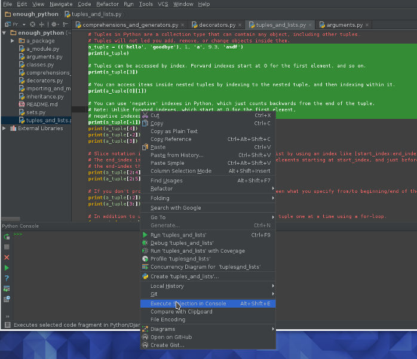

## "Enough" Python

#### Intro
This is a barebones Python quickstart for people who already know to program in one or more other languages.  It is meant to teach you just enough Python syntax so that you can quickly dive in and start hacking away.

Work through this tutorial by looking at the source files in the following (suggested) sequence, reading the comments
and executing snippets of code in your favorite editor.

1. Arguments
2. Decorators
3. Tuples & Lists
4. Sets
5. Classes
6. Inheritance
7. Importing & Modules

#### How to Run the Samples
###### "Simple" Way - Running in a Console
If you have downloaded and installed Python from [https://www.python.org/downloads/](https://www.python.org/downloads/), then all you really need is a console - a Terminal on MacOS/Linux, or a command prompt (cmd.exe) on Windows. You can run the code samples by retyping them into a Python terminal, and see what happens!

###### Using IDE

Another way, if you prefer a more polished experience, is to install an IDE like [PyCharm](https://www.jetbrains.com/pycharm/). You can copy and paste the sample code into PyCharm, select the code you wish to run, and hit 'Execute Selection in Console'.

PyCharm will "remember" the results each time you execute something.  For instance, in the example, once you have selected and executed the line that defines 'a_tuple', you can then separately select & execute any other line that references 'a_tuple', and it'll be there.
